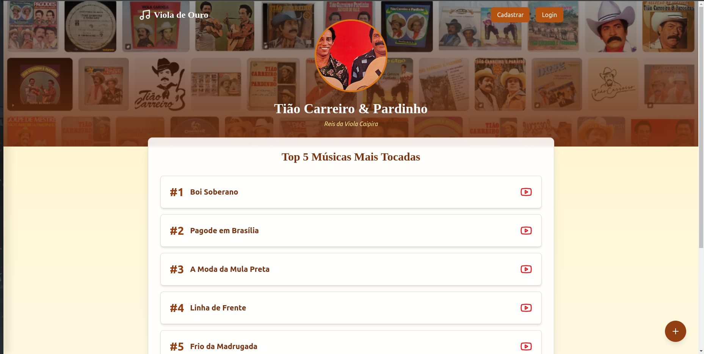

# TopMusicasSertanejaTiaCarreiro-Pardinho

- Iniciando o projeto com Docker
- 1 Na pasta 'backend' copie o arquivo '.env.example' e altere o nome para apenas '.env'
- 2 Inicie os Contêineres: docker-compose up -d --build ou sudo docker-compose up -d --build (a depender do grupo no docker precise utilizar o sudo)
- 3 Instale as dependências do Laravel:docker-compose exec backend composer install e docker-compose exec backend php artisan key:generate
- 4 Configure o banco de dados: docker-compose exec backend php artisan migrate
- 5 Para não precisar criar usuário administrador no banco de dados e nem os vídeos iniciais utilize o seeders: docker-compose exec backend php artisan db:seed

- Acesso a aplicação:
Frontend React: http://localhost:3000
Backend Laravel: http://localhost:8000

- Acesso a página adimistrativa:
Para acessar com o usuário admnistrativo basta fazer o login com o email "admin@gmail.com" e senha: "12345678" caso tenha usado o seedres, ou crie um usuário e no banco na tabela 'usuarios' e altere a coluna 'status' de 0 para 1.

- Testar requisição de consulta de top músicas:
Basta acessar a rota 'http://localhost:8000/api/musicaTop5' no metódo GET

- Testar requisição de consulta de música recomendadas:
Basta acessar a rota 'http://localhost:8000/api/musica' no metódo GET

- Testar requisição de consulta de música em espera de aprovação:
Basta acessar a rota 'http://localhost:8000/api/musicaEspera' no metódo GET

- Testar requisição de inserir recomendação de música:
Basta acessar a rota 'http://localhost:8000/api/musica' no metódo POST com o body passando nome, link e id do usuário que está recomendando, como exemplo:
{
  "nome": "Exemplo de humildedade2",
  "link": "https://www.youtube.com/watch?v=pBrSVpCFIZ02",
  "usuario_id": "1"
}

- Testar requisição de alterar dados da música:
Basta acessar a rota 'http://localhost:8000/api/musica/{id_usuario}' no metódo PUT com o body passando nome e link , como exemplo:
{
  "nome": "Boi Soberano 22",
  "link": "https://www.youtube.com/watch?v=lkQaLTnmNFw"
}

- Testar requisição desativar uma música:
Basta acessar a rota 'http://localhost:8000/api/musicaDelete/{id_musica}' no metódo PUT

- Testar requisição ativar uma música:
Basta acessar a rota 'http://localhost:8000/api/musicaAprovacao/{id_musica}' no metódo PUT

- Testar requisição de inserir usuário:
Basta acessar a rota 'http://localhost:8000/api/usuario' no metódo POST com o body passando usuario, email e senha, como exemplo:
{
  "nome": "Teste",
  "email": "teste@teste.api",
  "password": "1234567"
}

- Teste automatizado:
Caso queira executar os teste no sistema execute o comando no terminal: docker-compose exec backend php artisan test
